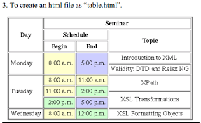

# UI/UX Development Advanced - Notes 
## HTML - HyperText Markup Language - 31st Jan '25

**HTML :** HTML stands for **Hypertext Markup Language**. It's the standard markup language for creating web pages and web applications. HTML provides the structure and content of a webpage by using a system of tags and attributes.

These tags define the various elements of a webpage such as headings, paragraphs, links, images, forms, and more. Web browsers interpret HTML documents and render them into visual web pages for users to view and interact with on the internet.

### What is Tag, Attributes, Elements, and content?
1. **Tag :** Imagine tags like little instruction manuals for the web browser. They come in pairs, a start tag < and an end tag >  with the element name in between. For example, 
< h1> is a start tag for a heading element, and </ h1> is its closing tag.
   - **Ex -** img tag for image, p tag for paragraph, h1 to h6 for heading.

2. **Attributes :** Attributes provide additional information about HTML elements and are always specified in the opening tag of an element. Attributes are made up of a name and a value, separated by an equal sign (=) and enclosed in double or single quotes. Attributes modify the behavior or appearance of an element.
   - **Ex :** the href attribute in an < a> tag specifies the URL of the link, and the src attribute in an < img> tag specifies the source (URL) of an image.

3. **Content :** This is the information that goes between the start and end tags of an element. It can be text, images, videos, or even other HTML elements (elements can be nested within each other). The content determines what the user sees or interacts with on the webpage.
   - **Ex :** `
This is Paragraph Content
`

4. **Elements :** An element is a complete set of tags and their content, including the opening tag, closing tag, and any content nested within them. Together, they define a particular component or piece of content on a webpage.
   - **Ex :**`
This is a Paragraph.
`

----------------------------------------------------------------------------------
## Internet and How iternet works.
### Question Set - 1 (31st Jan 2025)
1. what is IP address and type of IP address?
2. what is DNS?
3. What is Router?
4. What is Server and type of server?
5. How internet work?
-------------------------------------------------------------------------------

## Tag, Font, Multimedia and List in HTML - 7th Feb '25

### Type of Tag and Elements in HTML
### Type of Tag

1. **Semantic tag** - A semantic element clearly describes its meaning to both the browser and the developer.
Ex: < img>, < header>, < footer>, < article>, < table>
2. **Non-Semantic Tag** - div, span

1. **Self-Closing Tag**
   - **Definition:** Self-closing tags in HTML do not require a separate closing tag. They self-terminate with a slash at the end of the tag.
   - **Example:** input, br, hr, img, meta
2. **Seperate Closing Tag**
   - **Definition:** Separate closing tags are used for HTML elements that enclose content and require both an opening and a closing tag to define the content's boundaries.
   - **Example:** paragraph tag, ancher tag, heading tag

### Type of Elements
2. **Block level tag** - In HTML, block-level elements are elements that start a new line on a web page and take up the full width of their parent element.
Ex:  < div>, < p>, < h1> to < h6>, and < ul>, etc.
1. **inline tag** -  Inline elements are used within block-level elements to style or format specific parts of the content. They don’t start on a new line and only take up as much width as necessary.
Ex: < span>, < a>, < strong>, and < em>.

| Feature     | Block-Level Elements                          | Inline Elements                                       |
| ----------- | --------------------------------------------- | ----------------------------------------------------- |
| Line Breaks | Force line breaks before and after by default | Don't inherently create line breaks                   |
| Width       | Occupy full available width (by default)      | Only occupy space needed for their content            |
| Stacking    | Can stack vertically on top of each other     | Can flow horizontally alongside other inline elements |

### Image and Multimedia
**1. Image:** Used to embed images into a web page.
- **tag:** < img /> tag
- **Attributes:** 
  - **src:** (Required) Specifies the path to the image file.
  - **alt:** (Highly recommended) Provides alternative text for the image, essential for accessibility and SEO.
  - width: Sets the width of the image in pixels.
  - height: Sets the height of the image in pixels.

**2. Video:** Used to embed videos into a web page. 
- tag: video tag (Parent tag), source tag
- Attributes: 
  - src: (Required) Specifies the path to the video file.
  - controls: Adds playback controls (play, pause, volume, etc.).
  - autoplay: Starts playback automatically (use with caution for accessibility).
  - loop: Plays the video in a loop.
  - muted: Mutes the video by default.
  - type: Specifies the MIME type of the video file (optional, browser usually infers).
  - poster:  Sets an image to display before the video plays.
  - width: Sets the width of the video player in pixels.
  - height:  Sets the height of the video player in pixels.

**3. iframe:** Used to embed content from another website (like a YouTube video) directly into your web page.
- tag: iframe 
- attributes: 
  - src: (Required) Specifies the URL of the content to embed.
  - frameborder: Controls the display of a border around the iframe (0 for no border).
  - scrolling: Controls whether scrollbars appear in the iframe (e.g., "auto", "yes", or "no").
  - allowfullscreen: Enables fullscreen mode for the embedded content (if applicable).
  - width: Sets the width of the iframe in pixels.
  - height: Sets the height of the iframe in pixels.
**4. Audio:** Used to embed audio files into a web page.
- tag: audio tag < audio> & source tag < source/>.
- Attributes:
  - src: (Required) Specifies the path to the audio file.
  - controls: Adds playback controls (play, pause, volume, etc.).
  - autoplay: Starts playback automatically (use with caution for accessibility).
  - loop: Plays the audio in a loop.
  - muted: Mutes the audio by default.
  - type: Specifies the MIME type of the audio file (optional, browser usually infers).

## Heading in HTML
   - Six Heading Tag
   - h1 to h6

## Fonts tag in HTML
1. **b tag:** The < b> tag is used to make text bold. However, it doesn't carry any semantic meaning and is purely presentational.
2. **strong tag:** Similar to < b>, the < strong> tag also makes text bold, but it carries semantic weight, indicating that the enclosed text is of strong importance.
3. **i tag:** The < i> tag is used to italicize text. Like < b>, it doesn't carry any semantic meaning and is purely presentational.
4. **em tag:** Similar to < i>, the < em> tag italicizes text, but it carries semantic weight, indicating emphasis.
5. **u tag:** The < u> tag underlines text.
6. **s tag:** The < s> tag is used for strikethrough text, indicating that the content is no longer accurate or relevant.
7. **del tag:** Similar to < s>, the < del> tag also represents strikethrough text, but it carries semantic weight, indicating deleted text.
8. **mark tag:** The < mark> tag highlights text with a background color, typically yellow.
9. **sup:** The < sup> tag is used for superscript text, often used for mathematical expressions.
10. **sub:** The < sub> tag is used for subscript text, typically used for footnotes or chemical formulas.

### HTML List

- **Definition :** In HTML, a list is a way to organize and display related pieces of content in a structured format. Lists are useful for presenting information in a clear and organized manner, making it easier for users to understand the relationships between different items.

**Type of HTML List**

**1. Ordered List** An ordered list is defined using the < ol> tag in HTML. Each item within the list is defined using the < li> tag. By default, ordered lists display numbers (1, 2, 3...) to indicate the order of the items.
- Tag: ol tag (ordered list), li tag (list item)
- Attributes:
  - type: This attribute specifies the numbering or lettering style used for the list items. Here are the common options:
    - type="1" (default): Numbers the list items (1, 2, 3...)
    - type="a": Lowercase alphabetical lettering (a, b, c...)
    - type="A": Uppercase alphabetical lettering (A, B, C...)
    - type="i": Lowercase Roman numerals (i, ii, iii...)
    - type="I": Uppercase Roman numerals (I, II, III...)
  - start: This attribute allows you to define a starting number or letter for the list. For example, start="4" would begin the list with "4" instead of "1".
  - reversed: This attribute reverses the order of the numbering or lettering in the list.

**2. Unordered List:** An unordered list in HTML is used to represent a collection of items where the order doesn't necessarily matter. These lists are typically displayed with bullet points to visually group the items.
- An unordered list is defined using the < ul> tag in HTML.
- Each item within the list is defined using the < li> tag.
- By default, unordered lists display bullet points (●, ◦, etc.) for each list item.
- Tag: ul tag (unordered list), 
- Attribute: 
  - type="disc" (default): The standard disc bullet (●)
  - type="circle": A circle bullet (○)
  - type="square": A square bullet (■)
    
**3. Definition List:** Definition lists in HTML provide a structured way to define terms and their corresponding meanings. They are essentially like mini-glossaries embedded within your web page.
- Tag:
  - < dl>: This tag marks the beginning of the definition list.
  - < dt>: This tag defines the term being explained.
  - < dd>: This tag defines the description or definition of the term.
- Attribute: 
  - Definition lists are simple and don't have any specific attributes associated with their tags.
  - The structure relies on the proper nesting of tags:
  - The < dl> tag acts as a container for the entire definition list.
  - Within < dl>, each term being defined is wrapped in a < dt> tag.
  - The corresponding definition or description for the term goes inside a < dd> tag, always following the < dt> tag for the corresponding term.

---
### Question Set - 2 (07th Feb 2025)
1. Create an ordered list where the first item starts with the first letter of your name, and the last item starts with the last letter of your name. If the first letter comes later in the alphabet than the last letter, start with the first letter; otherwise, start with the last letter.

   - Name: Shubham → Ordered List starts with S and ends with M
   - Name: Akshay → Ordered List starts with Y and ends with A
2. Write an HTML snippet to create an unordered list with circle bullets, containing five items of your choice.
3. What are the different types of bullet styles available for unordered lists in HTML? Explain with examples.
4. What are HTML Entities?
5. Create List using HTML-

---
# HTML Table - 14th Feb
**Table:** Tables are a fundamental way to structure and present data in a two-dimensional format (rows and columns) on web pages. They are ideal for displaying information that has clear relationships between different categories.
- Tag: < table>< /table>
- Attributes: 
  - **border:** Sets the width of the table's border (in pixels).
  - **cellpadding:** Defines the space between the cell content and its border (in pixels).
  - **cellspacing:** Defines the space between adjacent cells (in pixels).
  - **collapse:** Specifies how adjacent table borders should be rendered (e.g., collapse for merging borders).
  - **width:** Sets the width of the table (can be a percentage or pixel value).
  - **align:** Aligns the table within its container (e.g., left, center, right).

**Table Structure**
- **< table>:** Defines the beginning and end of the table.
- **< tr>:** Defines a table row. Each row contains cells.
- **< td>:** Defines a table data cell. Used for regular table content.
- **< th>:** Defines a table header cell. Typically used for column labels and styled differently (often bold and centered).

---
### Question Set - 3 (14th Feb 2025)
1. Write HTML Code to create Table?
   
   1. Table 1 -
      

   2. Table 2
    

**Code and Notes Repo -** `https://github.com/ErShubham2908/SushantUIUX-2025`  
**Email :** `shubham.kumar@collegedekho.com`  
**Phone No:** 9560203004